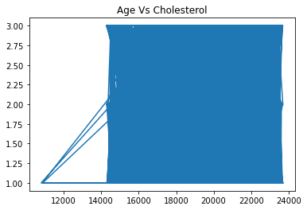
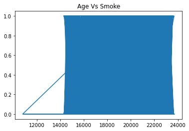
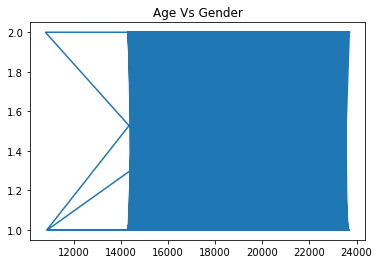

# Cardiovascular_analysis
This is a Cardiovascular Disease dataset
```python
import pandas as pd
import numpy as np
from matplotlib import pyplot as plt
```


```python
data = pd.read_csv('../data/cardio_base.csv')
```


```python
data.head(6)
```


<div>
<style scoped>
    .dataframe tbody tr th:only-of-type {
        vertical-align: middle;
    }

    .dataframe tbody tr th {
        vertical-align: top;
    }

    .dataframe thead th {
        text-align: right;
    }
</style>
<table border="1" class="dataframe">
  <thead>
    <tr style="text-align: right;">
      <th></th>
      <th>id</th>
      <th>age</th>
      <th>gender</th>
      <th>height</th>
      <th>weight</th>
      <th>ap_hi</th>
      <th>ap_lo</th>
      <th>cholesterol</th>
      <th>smoke</th>
    </tr>
  </thead>
  <tbody>
    <tr>
      <th>0</th>
      <td>0</td>
      <td>18393</td>
      <td>2</td>
      <td>168</td>
      <td>62.0</td>
      <td>110</td>
      <td>80</td>
      <td>1</td>
      <td>0</td>
    </tr>
    <tr>
      <th>1</th>
      <td>1</td>
      <td>20228</td>
      <td>1</td>
      <td>156</td>
      <td>85.0</td>
      <td>140</td>
      <td>90</td>
      <td>3</td>
      <td>0</td>
    </tr>
    <tr>
      <th>2</th>
      <td>2</td>
      <td>18857</td>
      <td>1</td>
      <td>165</td>
      <td>64.0</td>
      <td>130</td>
      <td>70</td>
      <td>3</td>
      <td>0</td>
    </tr>
    <tr>
      <th>3</th>
      <td>3</td>
      <td>17623</td>
      <td>2</td>
      <td>169</td>
      <td>82.0</td>
      <td>150</td>
      <td>100</td>
      <td>1</td>
      <td>0</td>
    </tr>
    <tr>
      <th>4</th>
      <td>4</td>
      <td>17474</td>
      <td>1</td>
      <td>156</td>
      <td>56.0</td>
      <td>100</td>
      <td>60</td>
      <td>1</td>
      <td>0</td>
    </tr>
    <tr>
      <th>5</th>
      <td>8</td>
      <td>21914</td>
      <td>1</td>
      <td>151</td>
      <td>67.0</td>
      <td>120</td>
      <td>80</td>
      <td>2</td>
      <td>0</td>
    </tr>
  </tbody>
</table>
</div>


```python
# data.dropna(inplace = True)
```


```python
data.shape
```


    (70000, 9)


```python
plt.title("Age Vs Cholesterol")
x = data['age']
y = data['cholesterol']
plt.plot(x, y)
plt.show()
```


    

    


```python
plt.title("Age Vs Smoke")
x = data['age']
y = data['smoke']
plt.plot(x, y)
plt.show()
```


    

    


```python
plt.title("Age Vs Gender")
x = data['age']
y = data['gender']
plt.plot(x, y)
plt.show()
```


    

    


```python

```
